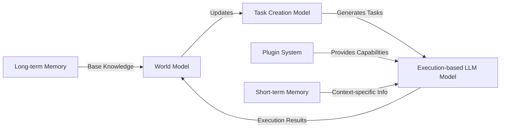

# Platz
FOSS Project for natural language AI Assistants - using GPT, LlaMA, FLAN etc. architectures.
Platz is an environment for multiple natural language AI Assistants to interact, train, and do work.

# Roadmap
1. Create core OODA architecture for AI Assistants using various LLM transformer architectures.
2. Create core API surface area for inference for architectures.
3. Persist conversations, memory, and presets for various agents and feed these back into agent startup / initialization.
4. Create external world adapters for agents to interact with the real world, such as VoIP, Slack, Notion, etc.

# Roadmap Agents
1. Software engineer agent.  (Reviews PRs, creates design docs, creates code from natural language description of features.)
2. Virtual assistant agent.  (Summarize and respond to emails, keep track of birthdays, 
3. Business manager agent.   (Generate business ideas, affiliate marketing, etc. and provide detailed blueprints for execution.)
4. Research assistant agent. (Summarize arxiv posts on machine learning / deep learning, provide briefs on latest changes in the field.)

# Core Architecture

The Platz Architecture consists of three main components: a world model, a task creation model, and an execution-based  model. The diagram below illustrates the architecture and relationships between these components.

