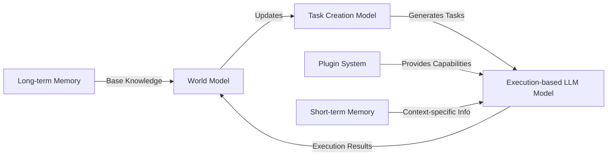

# Geist
FOSS Project for natural language AI Assistants - using GPT, LlaMA, Mistral etc. architectures.
Geist is a framework for multiple natural language AI Assistants to interact, train, and do work.

# Roadmap
1. Create core OODA architecture for AI Assistants using various LLM transformer architectures.
2. Create core API surface area for inference for architectures.
3. Persist conversations, memory, and presets for various agents and feed these back into agent startup / initialization.
4. Create external world adapters for agents to interact with the real world, such as VoIP, Slack, Notion, etc.

# Roadmap Agents
1. Software engineer spirit.  (Reviews PRs, creates design docs, creates code from natural language description of features.)
2. Virtual assistant spirit.  (Summarize and respond to emails, keep track of birthdays, 
3. Business manager spirit.   (Generate business ideas, affiliate marketing, etc. and provide detailed blueprints for execution.)
4. Research assistant spirit. (Summarize arxiv posts on machine learning / deep learning, provide briefs on latest changes in the field.)

# Core Architecture

The Geist Architecture consists of three main components: a world model, a task creation model, and an execution-based  model. The diagram below illustrates the architecture and relationships between these components.

# Versioning and Setup
## Install Postgresql
1. Version 16.2 on Mac or Windows

## Install Miniconda
1. Create a python 3.10 environment solve and install with windows_x64_environment.yml or mac_arm_environment.yml

## Setting up your environment
1. Make sure that your .env file is initialized - the following values are included but you may not need to set all of these depending on agent utilization and DEV/PROD settings:
    - OPENAI_TOKEN = TOKEN
    - POSTGRES_PWD = PASSWORD
    - POSTGRES_DB = geist
    - TWILIO_SID = ACCOUNT_SIDE
    - TWILIO_SOURCE = SOURCE_NUMBER
    - TWILIO_TOKEN = API_TOKEN
    - ENHANCED_LOGGING = FALSE
    - DB_HOST = localhost
    - HUGGING_FACE_HUB_TOKEN = TOKEN_VALUE

2. Copy any model weights into app/models/weights/MODEL_NAME.
    - Currently supported Models: llama_3_1
    - This can be run from python scripts/download_models.py 
    - If the download script doesn't work, direct download links can be found at : https://huggingface.co/meta-llama/Llama-3.1-8B-Instruct/tree/main

client/geist/.env settings:
    - REACT_APP_API_BASE_URL = http://localhost:3000

## Starting the solution
1. Start the postgresql server `PATH/pg_ctl -D DATA_PATH -l LOG_PATH start` 
2. Run `python bootstrap.py`

## Starting the solution with docker compose
1. Run `docker compose up`

## Supported Environments
1. Mac OS - ARM (m series) with linux container.

