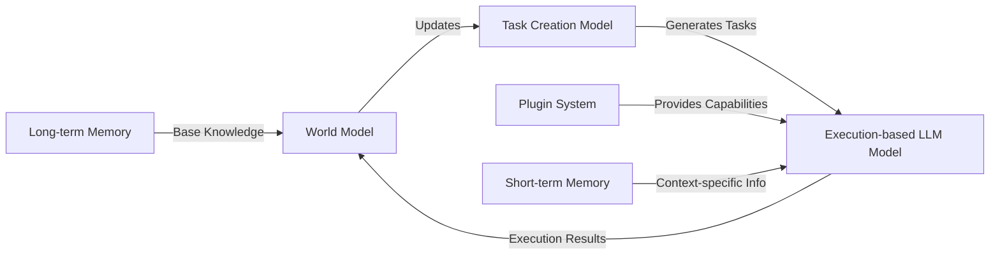

# Geist
FOSS Project for private local AI. Chat and Agents / Assistants.
Geist is a framework for multiple natural language AI Assistants to interact, train, and do work.

# Roadmap
1. Create core OODA architecture for AI Assistants using various LLM transformer architectures.
2. Create core API surface area for inference for architectures.
3. Persist conversations, memory, and presets for various agents and feed these back into agent startup / initialization.
4. Create external world adapters for agents to interact with the real world, such as VoIP, Slack, Notion, etc.
5. Voice and text modality with useful integrations and memory, as well as interaction with your local Obsidian archive. 

# Different Agents
1. Software engineer agent.  (Reviews PRs, creates design docs, creates code from natural language description of features.)
2. Virtual assistant agent.  (Summarize and respond to emails, keep track of birthdays, order gifts, do shopping.)
3. Business manager agent.   (Generate business ideas, affiliate marketing, etc. and provide detailed blueprints for execution.)
4. Research assistant agent. (Summarize arxiv posts on machine learning / deep learning, provide briefs on latest changes in the field.)

# Core Architecture

The Geist Architecture consists of three main components: a world model, a task creation model, and an execution-based  model. The diagram below illustrates the architecture and relationships between these components.

## Agent Architecture (New)

Geist now supports a flexible agent architecture with two main agent types:

- **LocalAgent**: Executes local models with pluggable MLX, llama.cpp, and Transformers runners
- **OnlineAgent**: Routes requests to OpenAI-compatible HTTP endpoints (OpenAI, Anthropic, Groq, Grok)

Both agents inherit from `BaseAgent` and support:
- Configurable generation parameters
- Backup provider fallback (OnlineAgent)
- User settings integration
- Factory-based instantiation

See `docs/agents.md` for detailed documentation.


```mermaid
flowchart LR
    A[World Model] -->|Updates| B[Task Creation Model]
    B -->|Generates Tasks| C[Execution-based LLM Model]
    C -->|Execution Results| A
    D[Plugin System] -->|Provides Capabilities| C
    E[Long-term Memory] -->|Base Knowledge| A
    F[Short-term Memory] -->|Context-specific Info| C
```

# Versioning and Setup

## Quickstart (uv, no Docker)

The default local setup uses [uv](https://docs.astral.sh/uv/) with the committed `uv.lock` and a local SQLite database — no Docker, conda, or PostgreSQL required:

```bash
# install uv (one time): https://docs.astral.sh/uv/getting-started/installation/
make sync    # create the environment from uv.lock (uv manages Python 3.11 for you)
make run     # initialize the SQLite database (data/geist.sqlite3) and start the backend
```

Optional extras:

```bash
uv sync --extra postgres   # psycopg2 driver, for GEIST_DATABASE_PROVIDER=postgresql
uv sync --extra voice      # sounddevice/sphn for the voice client tooling
uv sync --extra local-transformers  # Torch/Transformers local runner (Docker/Linux)
uv sync --extra local-mlx  # Apple-silicon MLX local runner
```

Note for Linux CPU runs: MLX and Moshi can JIT-compile kernels with the system compiler and fail on some compiler/architecture combinations. Docker defaults to portable interpreted paths with `MLX_DISABLE_COMPILE=1` and `NO_TORCH_COMPILE=1`; native runs can set the same values when needed. (MLX inference is primarily intended for Apple silicon.)

## Install PostgreSQL (optional)
SQLite is the default database provider, including in Docker Compose. To use PostgreSQL instead, install version 16.2, configure its connection values, and set `GEIST_DATABASE_PROVIDER=postgresql`.

## Setting up your environment
1. Make sure that your .env file is initialized - the following values are included but you may not need to set all of these depending on agent utilization and DEV/PROD settings:
    - OPENAI_API_KEY = TOKEN
    - POSTGRES_PWD = PASSWORD
    - POSTGRES_DB = geist
    - TWILIO_SID = ACCOUNT_SIDE
    - TWILIO_SOURCE = SOURCE_NUMBER
    - TWILIO_TOKEN = API_TOKEN
    - ENHANCED_LOGGING = FALSE
    - DB_HOST = localhost
    - HUGGING_FACE_HUB_TOKEN = TOKEN_VALUE
    - LOCAL_WEIGHTS_DIR = WHERE_YOUR_WEIGHTS_ARE (non docker mount)

### Database provider configuration

Select the SQLAlchemy provider with `GEIST_DATABASE_PROVIDER`. SQLite is the default and stores its database at `data/geist.sqlite3` unless overridden:

```bash
GEIST_DATABASE_PROVIDER=sqlite          # default; may be omitted
SQLITE_DATABASE_PATH=/absolute/path/to/geist.sqlite3
```

To use PostgreSQL instead, select it explicitly; it uses the existing `POSTGRES_*`, `DB_HOST`, and `DB_PORT` settings:

```bash
GEIST_DATABASE_PROVIDER=postgresql
```

`SQLITE_DATABASE_URL` can be used instead of `SQLITE_DATABASE_PATH`. `SQLALCHEMY_DATABASE_URL` overrides provider-specific URL construction when its URL scheme matches the selected provider.

Tests and alternate application entry points can inject `DatabaseConfig(provider=..., database_url=...)` directly into `configure_database()` without changing environment variables.

2. Start Geist and open the Models page to install local weights.
    - Windows x64 and Linux x64 download the pinned Qwen3 4B Q4_K_M GGUF or
      import an existing GGUF, then run it through managed `llama-server`.
    - macOS ARM64 downloads the pinned Meta Llama 3.1 8B snapshot and keeps the
      MLX backend. Accept the model license and set `HF_TOKEN` or
      `HUGGING_FACE_HUB_TOKEN` for the gated repository.
    - Downloads are resumable, cancellable, verified before inference, and
      stored beneath the user-writable `GEIST_MODEL_HOME`/data directory.
      `LOCAL_WEIGHTS_DIR` remains available for legacy MLX installations.


client/geist/.env settings:
    - REACT_APP_API_BASE_URL = http://localhost:3000

## Dependency supply-chain policy

Use lockfile-based installs and exact pins. Avoid ad hoc install commands that resolve new dependency versions without review.

### Frontend dependencies

Install the committed frontend lockfile without running package lifecycle scripts:

```bash
cd client/geist
npm ci --ignore-scripts --audit=false --fund=false
```

When adding or updating a frontend package, pin the exact version and update only the manifest and lockfile first:

```bash
cd client/geist
npm install --package-lock-only --ignore-scripts --save-exact PACKAGE@VERSION
npm audit --package-lock-only
```

Review both `package.json` and `package-lock.json` before committing. Do not use bare `npm install` or `npm i` for project setup.

### Backend dependencies

Native backend dependencies are declared with exact `==` pins in `pyproject.toml` and frozen in `uv.lock`. To add or update a package:

```bash
uv add PACKAGE==VERSION   # updates pyproject.toml and uv.lock together
```

Review the `pyproject.toml` and `uv.lock` diff before committing.

The Docker image installs from the same `pyproject.toml`/`uv.lock` via uv, so container and native dependencies stay in sync automatically — no separate environment files to maintain.

### Hooks

Install hooks after creating the environment:

```bash
pre-commit install
pre-commit run --all-files
```

The dependency policy hook rejects npm version ranges, unsafe frontend Docker installs, missing npm lockfile integrity entries, and unpinned Python dependencies in `pyproject.toml`.

## Starting the solution
1. Run `make run` (SQLite by default; initializes the database and starts the backend natively via uv)

To run against PostgreSQL natively instead:
1. Start the PostgreSQL server `PATH/pg_ctl -D DATA_PATH -l LOG_PATH start`.
2. Run `GEIST_DATABASE_PROVIDER=postgresql make run`

## Starting the solution with docker compose (no mlx support)
1. Run `make run-docker` (or `docker compose up`). The compose stack uses SQLite by default.

## Starting the frontend in Docker with a native backend (mlx support on Mac)
1. Run `make services` then `make run`
   - The optimized in-repo MLX implementation is the default.
   - Set `GEIST_MLX_IMPLEMENTATION=mlx_lm` to use the pinned `mlx-lm` runtime.
   - Set `GEIST_MLX_IMPLEMENTATION=manual` to select the in-repo implementation explicitly.
2. If you encounter port binding issues, make sure to disable airplay on mac. 


## Supported Environments
1. Mac OS - ARM (m series) with linux container.


## Scripts 
1. scripts/download_models.py - download models from huggingface.
2. scripts/copy_weights.py - copy weights from desktop to /app/models/weights/. Used for weights that are not hosted on huggingface. 
