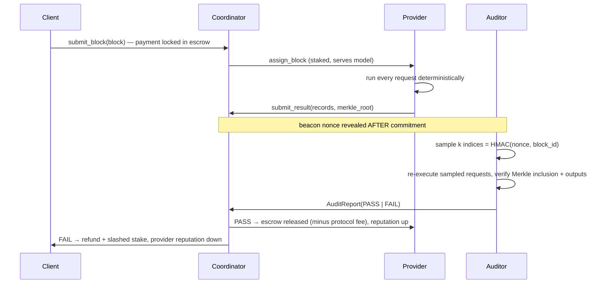

# Geist Compute Protocol: Verifiable LLM Inference with Sampling Audits

The `protocol/` package implements a marketplace-style protocol where clients
submit **blocks of LLM inference compute**, providers execute them, and
**sampling audits** keep providers honest without re-running every request.
It is a self-contained, dependency-free reference implementation: the ledger
is in-memory and the coordinator is a single process, but the message flow and
cryptographic commitments are the same ones a decentralized deployment would
put on a chain or settlement service.

## Roles

| Role        | Responsibility |
|-------------|----------------|
| Client      | Submits a `ComputeBlock` (ordered batch of `InferenceRequest`s against one model) and escrows payment. |
| Provider    | Stakes collateral, executes assigned blocks, submits an `InferenceRecord` per request plus a Merkle-root commitment. |
| Auditor     | Re-executes an unpredictable random sample of requests on a trusted reference runner and issues a verdict. |
| Coordinator | Tracks block lifecycle, enforces stake/assignment rules, and settles escrow based on audit verdicts. |

## Protocol flow



1. **Submission.** `Coordinator.submit_block` locks `block.price` from the
   client in escrow. The block id is the canonical hash of the model id,
   client, price, and every request — the work is content-addressed.
2. **Assignment.** Only registered providers with stake ≥ `min_stake` that
   serve the block's model can be assigned.
3. **Commitment.** The provider returns one record per request and a Merkle
   root over the record hashes. The coordinator recomputes the root before
   accepting, so the provider is bound to exactly these outputs.
4. **Audit.** A beacon nonce — revealed only after commitment — seeds an
   HMAC-SHA256 draw (`protocol/sampling.py`) that picks `k` request indices.
   Because the nonce is unknown at execution time, the provider cannot know
   which requests will be checked; because the draw is deterministic, anyone
   can verify the auditor sampled fairly. For each sampled index the auditor
   checks Merkle inclusion and re-executes the request on a reference runner,
   requiring exact output-text equality and per-token logprobs within
   `logprob_tolerance`.
5. **Settlement.** PASS releases escrow to the provider minus a protocol fee;
   FAIL refunds the client and slashes `slash_fraction` of the provider's
   stake to them.

## Why sampling works (and its limits)

A provider that corrupts a fraction *f* of a block's requests evades one audit
of sample size *k* with probability (1 − *f*)^*k*:

| cheat fraction | k = 8 | k = 16 | k = 32 |
|---------------:|------:|-------:|-------:|
| 5%             | 34%   | 56%    | 81%    |
| 10%            | 57%   | 81%    | 97%    |
| 25%            | 90%   | 99%    | ~100%  |

(`detection_probability` in `protocol/auditor.py`.) Combined with slashing,
cheating is negative-expected-value whenever
`slash × P(detect) > price × f`, so the economics — stake size, sample size,
and slash fraction — are what make small-scale cheating irrational, not the
audit alone. `test_cheating_outside_the_sample_evades_this_audit` documents
the residual per-audit risk explicitly.

## Determinism

Sampling audits only work if re-execution reproduces the original output.
The protocol therefore requires temperature-0 (or fixed-seed) decoding, and
`AuditPolicy.logprob_tolerance` absorbs benign numeric noise across hardware.
Real GPU inference is not always bit-exact across devices or batch sizes;
production systems attack this from three directions: pinning
runtime/hardware classes per model and comparing logprobs within a tolerance
(what this implementation does), committing to locality-sensitive hashes of
intermediate activations that are robust across GPU types and kernels
(TOPLOC), or making the computation itself bitwise reproducible with
fixed-order floating-point operator libraries (Gensyn's RepOps, <30% overhead
on large matmuls). `GeistAgentRunner` (`protocol/geist_runner.py`) adapts any
Geist `BaseAgent` as a runner, so audits can run against the local MLX/vLLM
stack or an online provider.

## Does this already exist?

Yes — this design space is active, and several systems combine "rent out
blocks of compute" with probabilistic verification for ML/LLM workloads:

- **Hyperbolic's Proof of Sampling** ([PoSP, arXiv:2405.00295](https://arxiv.org/pdf/2405.00295)) —
  spot-checks a random fraction of inference results with validators and
  slashes discrepancies: the same sampling-audit economics implemented here.
  Two ideas worth borrowing that this reference does not implement: the
  sampling rate is derived game-theoretically so that honest behavior is a
  pure-strategy Nash equilibrium, and it adapts per node — new providers get
  sampled more, providers with proven track records less. Adopted by
  EigenLayer as an AVS verification layer.
- **Prime Intellect's TOPLOC** ([arXiv:2501.16007](https://arxiv.org/pdf/2501.16007)) —
  providers commit to locality-sensitive hashes of intermediate activations
  (~258 bytes per 32 tokens) instead of output hashes; validators re-check up
  to 100× faster than inference and the commitment is robust across GPU
  types, tensor-parallel layouts, and attention kernels — a direct answer to
  the nondeterminism problem that output-hash audits (like this one) dodge
  via tolerances. Used in production for INTELLECT-2's distributed RL.
- **Gensyn's Verde** ([arXiv:2502.19405](https://arxiv.org/abs/2502.19405)) —
  refereed delegation for both training *and* inference: replicate the work
  across a few providers, and on disagreement a referee bisects the
  computational graph to the first divergent operator, so only that operator
  is re-run to settle the dispute. Made possible by RepOps, a library of
  bitwise-reproducible CUDA operators (fixed floating-point evaluation
  order), which eliminates the tolerance games entirely.
- **VeriLLM** ([arXiv:2509.24257](https://arxiv.org/html/2509.24257)) — a
  2025 academic design very close to this package's shape: commit-then-sample
  audits with random openings over decentralized LLM inference, claiming ~1%
  verification overhead.
- **opML / ORA** ([arXiv:2401.17555](https://arxiv.org/pdf/2401.17555)) —
  optimistic ML: results are accepted unless challenged within a dispute
  window, with fraud proofs bisecting the computation.
- **zkML (EZKL, zkLLM)** — full cryptographic proofs of inference; strongest
  guarantees, but still impractical at LLM scale (proving a 1M-parameter
  model takes ~16 minutes; a 70B model extrapolates to days), which is
  exactly why sampling/optimistic schemes exist. Hybrids (zk-OPML,
  optimistic TEE-rollups) and TEE attestation on H100-class hardware are the
  emerging middle ground.
- **Bittensor** — incentivized inference network where validators score miner
  outputs (quality-weighted rather than correctness-audited).
- **Akash, Golem, io.net, Petals** — compute/GPU marketplaces and volunteer
  inference swarms; they rent the compute but largely trust the operator,
  i.e., the market without the audit layer.

What this package contributes to Geist is a small, testable reference of the
audit-marketplace core — content-addressed blocks, post-commitment beacon
sampling, Merkle-bound results, stake/escrow/slash settlement — that plugs
into Geist's own agents as runners. The clearest upgrade paths suggested by
the literature: PoSP-style reputation-adaptive sample sizes, and swapping
output-hash records for TOPLOC-style activation commitments once a
deterministic or commitment-friendly runner is available.

## Usage

```python
from protocol import (
    AuditPolicy, Auditor, ComputeBlock, Coordinator, DeterministicStubRunner,
    InferenceRequest, Ledger, ProtocolConfig,
)

ledger = Ledger()
coordinator = Coordinator(
    ledger=ledger,
    auditor=Auditor(DeterministicStubRunner(), AuditPolicy(sample_size=16)),
    config=ProtocolConfig(min_stake=1_000, slash_fraction=0.5),
)

ledger.deposit("alice", 10_000)
ledger.deposit("gpu-farm", 5_000)
coordinator.register_provider("gpu-farm", stake=2_000, supported_models={"llama-3.1-8b"})

block = ComputeBlock(
    model_id="llama-3.1-8b",
    client_id="alice",
    price=500,
    requests=tuple(
        InferenceRequest(request_id=f"req-{i}", prompt=p, temperature=0.0)
        for i, p in enumerate(["Summarize ...", "Translate ..."])
    ),
)
block_id = coordinator.submit_block(block)
coordinator.assign_block(block_id, "gpu-farm")
# provider executes, builds records + Merkle root, then:
# coordinator.submit_result(result)
# coordinator.run_audit(block_id, beacon_nonce)
# coordinator.settle(block_id)
```

Run the test suite with `pytest tests/protocol`.
